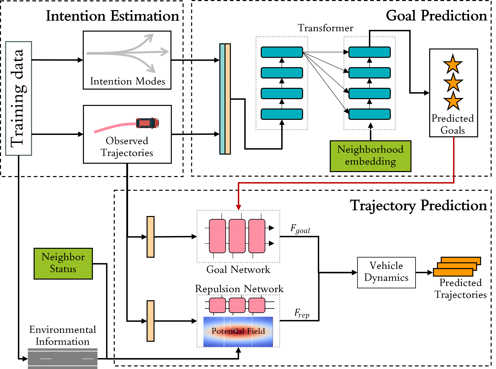

# Goal-based Neural Physics Vehicle Trajectory Prediction Model (GNP)

[](https://www.python.org/)
[](https://pytorch.org/)
[](LICENSE)
[](https://arxiv.org/abs/2409.15182)

## Abstract

Vehicle trajectory prediction plays a vital role in intelligent transportation systems and autonomous driving, as it significantly affects vehicle behavior planning and control, thereby influencing traffic safety and efficiency. Numerous studies have been conducted to predict short-term vehicle trajectories in the immediate future. However, long-term trajectory prediction remains a major challenge due to accumulated errors and uncertainties. Additionally, balancing accuracy with interpretability in the prediction is another challenging issue in predicting vehicle trajectory. 

To address these challenges, this paper proposes a **Goal-based Neural Physics Vehicle Trajectory Prediction Model (GNP)**. The GNP model simplifies vehicle trajectory prediction into a two-stage process: determining the vehicle's goal and then choosing the appropriate trajectory to reach this goal. The GNP model contains two sub-modules to achieve this process. The first sub-module employs a multi-head attention mechanism to accurately predict goals. The second sub-module integrates a deep learning model with a physics-based social force model to progressively predict the complete trajectory using the generated goals. The GNP demonstrates state-of-the-art long-term prediction accuracy compared to four baseline models. We provide interpretable visualization results to highlight the multi-modality and inherent nature of our neural physics framework.

## Key Features

- **🎯 Goal-based Prediction**: Explicitly models vehicle intentions and predicts multiple potential goals
- **🔬 Physics-Informed**: Integrates neural networks with social force models for interpretable predictions
- **⚡ Real-time Performance**: Efficient implementation suitable for real-world deployment (36.7ms per sample)
- **📊 State-of-the-art Accuracy**: Superior long-term prediction performance on highway datasets
- **🔍 Interpretable Results**: Visualizable force analysis and intention modeling
- **🌐 Multi-modal Output**: Generates multiple trajectory hypotheses with confidence measures

## Model Architecture

The GNP model consists of two main sub-modules:

### 1. Goal Prediction Sub-module
- **Intention Mode Extraction**: Clusters trajectory patterns to identify driving intentions
- **Transformer Encoder-Decoder**: Enhanced architecture for goal prediction
- **Top-K Goal Sampling**: Generates multiple potential destinations and their probabilities

### 2. Trajectory Prediction Sub-module (Neural Social Force)
- **Goal Attraction Force**: Neural network-learned attraction towards predicted goals
- **Repulsion Force**: Physics-based collision avoidance and lane constraints
- **Vehicle Dynamics**: Numerical integration for trajectory completion
- **Interpretable Parameters**: Learnable force coefficients with physical meaning



*Figure 1: GNP model architecture with dual sub-module framework*

## Quick Start

### Prerequisites
- Download the HighD and/or NGSIM datasets
- Ensure Python environment is set up with required dependencies

### Step 1: Goal Prediction Sub-module

#### 1.1 Data Preparation
```bash
# Navigate to goal-prediction directory
cd goal-prediction/

# Process and load data (creates train, validation, and test datasets)
python loaddata.py
```

#### 1.2 Train Goal Prediction Model
```bash
# Train the transformer-based goal prediction model
python train.py
```

**Note**: The `train.py` script handles training, validation, and inference automatically. It will:
- Train the goal prediction model using the processed data
- Validate the model during training
- Save the best model checkpoints
- Perform inference on test data

### Step 2: Neural Social Force Trajectory Prediction Sub-module

#### 2.1 Train Goal Attraction Force (First Stage)
```bash
# Navigate to neural social force directory
cd "neural social force trajectory prediction/"

# Train only the goal attraction force component
python train_goals.py
```

#### 2.2 Train Full Model with Repulsion Forces (Second Stage)
```bash
# Train the complete model with both attraction and repulsion forces
python train_repulsion_fulltest.py
```

**Note**: The trajectory prediction follows a two-stage training approach:
1. **Stage 1** (`train_goals.py`): Trains only the goal attraction force using the goals predicted from Step 1
2. **Stage 2** (`train_repulsion_fulltest.py`): Trains the full model incorporating both goal attraction and repulsion forces for complete trajectory prediction

### Step 3: Configuration (Optional)

You can modify the training parameters by editing the configuration files:

```bash
# Edit goal prediction configuration
cd "neural social force trajectory prediction/config/"

# For HighD dataset goals configuration
nano righd_goals.yaml

# For HighD dataset repulsion configuration  
nano righd_rep.yaml
```


## Repository Structure

```
GNP--Goal-based-Neural-Physics-Vehicle-Trajectory-/
├── README.md
├── LICENSE
├── .gitignore
│
├── assets/                              # Project assets and visualizations
│
├── goal-prediction/                     # Goal Prediction Sub-module
│   ├── config/
│   │   ├── __pycache__/                # Python cache files
    │   └── HighD.py                    # HighD dataset processing for goal prediction
    │    └── Ngsim.py                    # NGSIM dataset processing for goal prediction
│   ├── loaddata.py                     # Data loading utilities for goal prediction
│   ├── model.py                        # Goal prediction model implementation
│   ├── train.py                        # Training script for goal prediction
│   ├── transformer_decoder.py          # Transformer decoder implementation
│   ├── transformer_encoder.py          # Transformer encoder implementation
│   └── utils.py                        # Utility functions for goal prediction
│
└── neural social force trajectory prediction/    # Neural Social Force Sub-module
    ├── config/
    │   ├── righd_goals.yaml            # HighD dataset goals configuration
    │   └── righd_rep.yaml              # HighD dataset repulsion configuration
    ├── loaddata_goals.py               # Data loading for goal-based prediction
    ├── loaddata_repulsion.py           # Data loading for repulsion modeling
    ├── model_goals.py                  # Goal attraction force model
    ├── model_repulsion.py              # Repulsion force model
    ├── train_goals.py                  # Training script for goal attraction
    ├── train_repulsion_fulltest.py     # Full testing for repulsion training
    └── utils.py                        # Utility functions for trajectory prediction
```

## Installation

### Prerequisites
- Python 3.8+
- CUDA-compatible GPU (recommended)
- 8GB+ RAM

### Dependencies

```bash
# Create new conda environment
conda create -n gnp python=3.8

# Activate environment
conda activate gnp

# Install PyTorch with CUDA support
conda install pytorch==2.0.0 torchvision==0.15.0 torchaudio==2.0.0 pytorch-cuda=11.8 -c pytorch -c nvidia

# Install core scientific packages
conda install numpy=1.24.3 pandas=2.0.3 scipy=1.10.1 scikit-learn=1.3.0 matplotlib=3.7.2 seaborn=0.12.2

# Install additional packages via pip
pip install opencv-python==4.11.0.86 kornia==0.7.3 h5py==3.11.0 pyarrow==17.0.0 polars==1.8.2 pyyaml==6.0.1
```

### GPU Support

This project requires CUDA-compatible GPU for optimal performance. The environment is configured for:
- **CUDA Version**: 11.8
- **PyTorch**: 2.0.0 with CUDA support
- **GPUs**: RTX 4080.


## Datasets

### Supported Datasets
- **HighD**: German highway drone recordings
- **NGSIM**: US highway camera data (10 Hz, I-80 & US-101)


## To-Do List

### High Priority
- ✅ **Goal Prediction sub-module**: Codes for transformer-based goal-prediction sub-module
- ✅ **Neural Social Force Trajectory Prediction sub-module**: Codes for neural social force including attraction and repulsive force
- ✅ **HighD dataset Support**: Support HighD dataset and data processing
- ✅ **Repository Structure**: Improve confidence estimation for safety-critical applications
- 🚧 **NGSIM dataset Support**: Support NGSIM dataset and data processing
- 🚧 **Data preprocessing**: Preprocessing raw data files
- 🚧 **Installation**: Installation and implementation detail for data preparation, training, and evaluation

## Citation

If you use this code in your research, please cite our paper:

```bibtex
@article{gan2024goal,
  title={Goal-based Neural Physics Vehicle Trajectory Prediction Model},
  author={Gan, Rui and Shi, Haotian and Li, Pei and Wu, Keshu and An, Bocheng and Li, Linheng and Ma, Junyi and Ma, Chengyuan and Ran, Bin},
  journal={arXiv preprint arXiv:2409.15182},
  year={2024}
}
```

## License

This project is licensed under the MIT License - see the [LICENSE](LICENSE) file for details.

## Contact

For any questions or suggestions, please open an issue.
- **Rui Gan**: [rgan6@wisc.edu](mailto:rgan6@wisc.edu)

## Updates

- **2024-06-01**: Initial repository setup and model implementation
- **2024-06-06**: Added comprehensive documentation and examples

---

**Project Status**: ✅ Active Development | 📊 Research Paper Submitted | 🚀 Ready for Deployment
